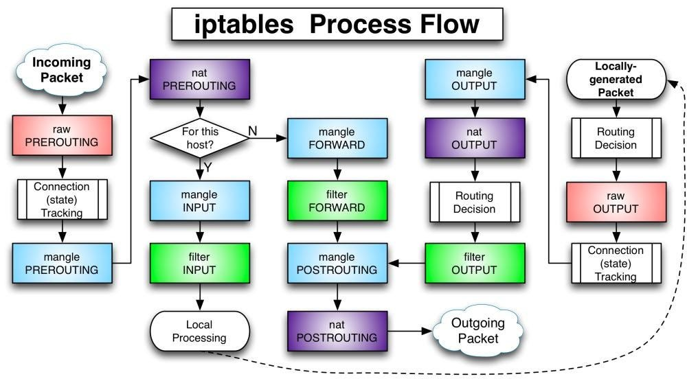

# Часть 2

## Узлы

Буквами A,B,C будут назначены три узла

1-ый контейнер (A):

```sh
root@A:~# ip a
...
2: eth0@if166: <BROADCAST,MULTICAST,UP,LOWER_UP> mtu 1500 qdisc noqueue state UP group default
    link/ether 6e:67:c1:eb:23:a9 brd ff:ff:ff:ff:ff:ff link-netnsid 0
    inet 192.168.208.2/20 brd 192.168.223.255 scope global eth0
       valid_lft forever preferred_lft forever
```

2-ой контейнер (B):

```sh
root@B:~# ip a
1: lo: <LOOPBACK,UP,LOWER_UP> mtu 65536 qdisc noqueue state UNKNOWN group default qlen 1000
    link/loopback 00:00:00:00:00:00 brd 00:00:00:00:00:00
    inet 127.0.0.1/8 scope host lo
       valid_lft forever preferred_lft forever
    inet6 ::1/128 scope host
       valid_lft forever preferred_lft forever
2: eth0@if168: <BROADCAST,MULTICAST,UP,LOWER_UP> mtu 1500 qdisc noqueue state UP group default
    link/ether e2:62:40:4e:d4:cb brd ff:ff:ff:ff:ff:ff link-netnsid 0
    inet 192.168.208.3/20 brd 192.168.223.255 scope global eth0
       valid_lft forever preferred_lft forever
```

3-ий контейнер (C):

```sh
root@C:~# ip a
1: lo: <LOOPBACK,UP,LOWER_UP> mtu 65536 qdisc noqueue state UNKNOWN group default qlen 1000
    link/loopback 00:00:00:00:00:00 brd 00:00:00:00:00:00
    inet 127.0.0.1/8 scope host lo
       valid_lft forever preferred_lft forever
    inet6 ::1/128 scope host
       valid_lft forever preferred_lft forever
2: eth0@if171: <BROADCAST,MULTICAST,UP,LOWER_UP> mtu 1500 qdisc noqueue state UP group default
    link/ether 16:d1:70:fb:c4:5c brd ff:ff:ff:ff:ff:ff link-netnsid 0
    inet 192.168.208.4/20 brd 192.168.223.255 scope global eth0
       valid_lft forever preferred_lft forever
```

## Топология

Физическая (`docker`): A, B и C в одной `bridge`-сети `docker`

Логическая (будет строиться в дальнейших пунктах этой части): 
- A: `192.168.1.1`
- B: `192.168.1.2` + `192.168.2.1`
- C: `192.168.2.2`

`A-B-C`

## Взаимный пинг

```sh
root@A:~# ping -c3 192.168.208.3
PING 192.168.208.3 (192.168.208.3) 56(84) bytes of data.
64 bytes from 192.168.208.3: icmp_seq=1 ttl=64 time=0.129 ms
64 bytes from 192.168.208.3: icmp_seq=2 ttl=64 time=0.089 ms
64 bytes from 192.168.208.3: icmp_seq=3 ttl=64 time=0.089 ms

--- 192.168.208.3 ping statistics ---
3 packets transmitted, 3 received, 0% packet loss, time 2054ms
rtt min/avg/max/mdev = 0.089/0.102/0.129/0.018 ms
root@A:~# ping -c3 192.168.208.4
PING 192.168.208.4 (192.168.208.4) 56(84) bytes of data.
64 bytes from 192.168.208.4: icmp_seq=1 ttl=64 time=0.088 ms
64 bytes from 192.168.208.4: icmp_seq=2 ttl=64 time=0.091 ms
64 bytes from 192.168.208.4: icmp_seq=3 ttl=64 time=0.093 ms

--- 192.168.208.4 ping statistics ---
3 packets transmitted, 3 received, 0% packet loss, time 2030ms
rtt min/avg/max/mdev = 0.088/0.090/0.093/0.002 ms
```

```sh
root@B:~# ping -c3 192.168.208.2
PING 192.168.208.2 (192.168.208.2) 56(84) bytes of data.
64 bytes from 192.168.208.2: icmp_seq=1 ttl=64 time=0.049 ms
64 bytes from 192.168.208.2: icmp_seq=2 ttl=64 time=0.087 ms
64 bytes from 192.168.208.2: icmp_seq=3 ttl=64 time=0.075 ms

--- 192.168.208.2 ping statistics ---
3 packets transmitted, 3 received, 0% packet loss, time 2028ms
rtt min/avg/max/mdev = 0.049/0.070/0.087/0.015 ms
root@B:~# ping -c3 192.168.208.4
PING 192.168.208.4 (192.168.208.4) 56(84) bytes of data.
64 bytes from 192.168.208.4: icmp_seq=1 ttl=64 time=0.156 ms
64 bytes from 192.168.208.4: icmp_seq=2 ttl=64 time=0.094 ms
64 bytes from 192.168.208.4: icmp_seq=3 ttl=64 time=0.199 ms

--- 192.168.208.4 ping statistics ---
3 packets transmitted, 3 received, 0% packet loss, time 2044ms
rtt min/avg/max/mdev = 0.094/0.149/0.199/0.043 ms
```

```sh
root@C:~# ping -c3 192.168.208.2
PING 192.168.208.2 (192.168.208.2) 56(84) bytes of data.
64 bytes from 192.168.208.2: icmp_seq=1 ttl=64 time=0.068 ms
64 bytes from 192.168.208.2: icmp_seq=2 ttl=64 time=0.096 ms
64 bytes from 192.168.208.2: icmp_seq=3 ttl=64 time=0.093 ms

--- 192.168.208.2 ping statistics ---
3 packets transmitted, 3 received, 0% packet loss, time 2039ms
rtt min/avg/max/mdev = 0.068/0.085/0.096/0.012 ms
root@C:~# ping -c3 192.168.208.3
PING 192.168.208.3 (192.168.208.3) 56(84) bytes of data.
64 bytes from 192.168.208.3: icmp_seq=1 ttl=64 time=0.076 ms
64 bytes from 192.168.208.3: icmp_seq=2 ttl=64 time=0.073 ms
64 bytes from 192.168.208.3: icmp_seq=3 ttl=64 time=0.087 ms

--- 192.168.208.3 ping statistics ---
3 packets transmitted, 3 received, 0% packet loss, time 2046ms
rtt min/avg/max/mdev = 0.073/0.078/0.087/0.006 ms
```

## Назначение новых IP-адресов

A:

```sh
root@A:~# ip addr add 192.168.1.1/24 dev eth0
root@A:~# ip a
...
2: eth0@if166: <BROADCAST,MULTICAST,UP,LOWER_UP> mtu 1500 qdisc noqueue state UP group default
    link/ether 6e:67:c1:eb:23:a9 brd ff:ff:ff:ff:ff:ff link-netnsid 0
    inet 192.168.208.2/20 brd 192.168.223.255 scope global eth0
       valid_lft forever preferred_lft forever
    inet 192.168.1.1/24 scope global eth0
       valid_lft forever preferred_lft forever
```

B:

```sh
root@B:~# ip addr add 192.168.1.2/24 dev eth0
ip addr add 192.168.2.1/24 dev eth0
root@B:~# ip a
...
2: eth0@if168: <BROADCAST,MULTICAST,UP,LOWER_UP> mtu 1500 qdisc noqueue state UP group default
    link/ether e2:62:40:4e:d4:cb brd ff:ff:ff:ff:ff:ff link-netnsid 0
    inet 192.168.208.3/20 brd 192.168.223.255 scope global eth0
       valid_lft forever preferred_lft forever
    inet 192.168.1.2/24 scope global eth0
       valid_lft forever preferred_lft forever
    inet 192.168.2.1/24 scope global eth0
       valid_lft forever preferred_lft forever
```

C:

```sh
root@C:~# ip addr add 192.168.2.2/24 dev eth0
root@C:~# ip a
...
2: eth0@if171: <BROADCAST,MULTICAST,UP,LOWER_UP> mtu 1500 qdisc noqueue state UP group default
    link/ether 16:d1:70:fb:c4:5c brd ff:ff:ff:ff:ff:ff link-netnsid 0
    inet 192.168.208.4/20 brd 192.168.223.255 scope global eth0
       valid_lft forever preferred_lft forever
    inet 192.168.2.2/24 scope global eth0
       valid_lft forever preferred_lft forever
```

Адреса назначены

## Настройка IP-forwarding

B:

```sh
root@B:~# echo 1 > /proc/sys/net/ipv4/ip_forward
-bash: /proc/sys/net/ipv4/ip_forward: Read-only file system
root@B:~# cat /proc/sys/net/ipv4/ip_forward
1
```

## Настройка таблиц маршрутизации

Попробуем с A пропинговать B через сеть `192.168.2.0/24`:

```sh
root@A:~# ping -c3 192.168.2.1
PING 192.168.2.1 (192.168.2.1) 56(84) bytes of data.
^C
--- 192.168.2.1 ping statistics ---
3 packets transmitted, 0 received, 100% packet loss, time 2046ms
```

Почему не выходит? Рассмотрим таблицу маршрутизации:

```sh
root@A:~# ip r
default via 192.168.208.1 dev eth0
192.168.1.0/24 dev eth0 proto kernel scope link src 192.168.1.1
192.168.208.0/20 dev eth0 proto kernel scope link src 192.168.208.2
```

Пакет уйдёт на `default gateway`: `192.168.208.1` - `docker gateway`, у которого нет информации о сети `192.168.2.0/24`

Поэтому нужно настроить стандартный маршрут для `192.168.2.0/24` так, чтобы он шёл через узел `192.168.1.2` (адрес B в сети `192.168.1.0/24`):

```sh
root@A:~# ip route add 192.168.2.0/24 via 192.168.1.2
root@A:~# ip r
default via 192.168.208.1 dev eth0
192.168.1.0/24 dev eth0 proto kernel scope link src 192.168.1.1
192.168.2.0/24 via 192.168.1.2 dev eth0
192.168.208.0/20 dev eth0 proto kernel scope link src 192.168.208.2
```

Попытаемся пропинговать теперь:

```sh
root@A:~# ping -c3 192.168.2.1
PING 192.168.2.1 (192.168.2.1) 56(84) bytes of data.
64 bytes from 192.168.2.1: icmp_seq=1 ttl=64 time=0.087 ms
64 bytes from 192.168.2.1: icmp_seq=2 ttl=64 time=0.087 ms
64 bytes from 192.168.2.1: icmp_seq=3 ttl=64 time=0.090 ms

--- 192.168.2.1 ping statistics ---
3 packets transmitted, 3 received, 0% packet loss, time 2034ms
rtt min/avg/max/mdev = 0.087/0.088/0.090/0.001 ms
root@A:~# ping -c3 192.168.2.2
PING 192.168.2.2 (192.168.2.2) 56(84) bytes of data.
From 192.168.1.2 icmp_seq=2 Redirect Host(New nexthop: 192.168.2.2)
From 192.168.1.2 icmp_seq=3 Redirect Host(New nexthop: 192.168.2.2)

--- 192.168.2.2 ping statistics ---
3 packets transmitted, 0 received, +2 errors, 100% packet loss, time 2033ms
```

B отвечает, C - нет. Почему? В таблице маршрутизации C нет информации о том, куда отправить пакет из сети `192.168.1.0/24`:

```sh
root@C:~# ip r
default via 192.168.208.1 dev eth0
192.168.2.0/24 dev eth0 proto kernel scope link src 192.168.2.2
192.168.208.0/20 dev eth0 proto kernel scope link src 192.168.208.4
```

Это надо также добавить:

```sh
root@C:~# ip route add 192.168.1.0/24 via 192.168.2.1
root@C:~# ip r
default via 192.168.208.1 dev eth0
192.168.1.0/24 via 192.168.2.1 dev eth0
192.168.2.0/24 dev eth0 proto kernel scope link src 192.168.2.2
192.168.208.0/20 dev eth0 proto kernel scope link src 192.168.208.4
```

Проверим пинг с A:

```sh
root@A:~# ping -c3 192.168.2.2
PING 192.168.2.2 (192.168.2.2) 56(84) bytes of data.
64 bytes from 192.168.2.2: icmp_seq=1 ttl=63 time=0.099 ms
64 bytes from 192.168.2.2: icmp_seq=2 ttl=63 time=0.077 ms
From 192.168.1.2 icmp_seq=3 Redirect Host(New nexthop: 192.168.2.2)

--- 192.168.2.2 ping statistics ---
3 packets transmitted, 2 received, +1 errors, 33.3333% packet loss, time 2052ms
rtt min/avg/max/mdev = 0.077/0.088/0.099/0.011 ms
```

Ошибка с `Redirect Host...` появляется из-за `ICMP Redirect`

Проверим пинг B и A, отправляя с C:

```sh
root@C:~# ping -c3 192.168.1.2
PING 192.168.1.2 (192.168.1.2) 56(84) bytes of data.
64 bytes from 192.168.1.2: icmp_seq=1 ttl=64 time=0.066 ms
64 bytes from 192.168.1.2: icmp_seq=2 ttl=64 time=0.069 ms
64 bytes from 192.168.1.2: icmp_seq=3 ttl=64 time=0.155 ms

--- 192.168.1.2 ping statistics ---
3 packets transmitted, 3 received, 0% packet loss, time 2048ms
rtt min/avg/max/mdev = 0.066/0.096/0.155/0.041 ms
root@C:~# ping -c3 192.168.1.1
PING 192.168.1.1 (192.168.1.1) 56(84) bytes of data.
64 bytes from 192.168.1.1: icmp_seq=1 ttl=63 time=0.094 ms
From 192.168.2.1 icmp_seq=2 Redirect Host(New nexthop: 192.168.1.1)
64 bytes from 192.168.1.1: icmp_seq=2 ttl=63 time=0.123 ms

--- 192.168.1.1 ping statistics ---
2 packets transmitted, 2 received, +1 errors, 0% packet loss, time 1026ms
rtt min/avg/max/mdev = 0.094/0.108/0.123/0.014 ms
```

Получаем то же самое

## Анализ трафика через `tcpdump` на узле B

Слушаем на B:

```sh
root@B:~# tcpdump -i eth0 icmp
tcpdump: verbose output suppressed, use -v[v]... for full protocol decode
listening on eth0, link-type EN10MB (Ethernet), snapshot length 262144 bytes
16:39:39.581159 IP 192.168.1.1 > 192.168.2.2: ICMP echo request, id 139, seq 1, length 64
16:39:39.581201 IP 192.168.1.1 > 192.168.2.2: ICMP echo request, id 139, seq 1, length 64
16:39:39.581221 IP 192.168.2.2 > 192.168.1.1: ICMP echo reply, id 139, seq 1, length 64
16:39:39.581227 IP 192.168.2.1 > 192.168.2.2: ICMP redirect 192.168.1.1 to host 192.168.1.1, length 92
16:39:39.581228 IP 192.168.2.2 > 192.168.1.1: ICMP echo reply, id 139, seq 1, length 64
16:39:40.609462 IP 192.168.1.1 > 192.168.2.2: ICMP echo request, id 139, seq 2, length 64
16:39:40.609541 IP 192.168.1.2 > 192.168.1.1: ICMP redirect 192.168.2.2 to host 192.168.2.2, length 92
16:39:40.609546 IP 192.168.1.1 > 192.168.2.2: ICMP echo request, id 139, seq 2, length 64
16:39:40.609575 IP 192.168.2.2 > 192.168.1.1: ICMP echo reply, id 139, seq 2, length 64
16:39:40.609582 IP 192.168.2.1 > 192.168.2.2: ICMP redirect 192.168.1.1 to host 192.168.1.1, length 92
16:39:40.609583 IP 192.168.2.2 > 192.168.1.1: ICMP echo reply, id 139, seq 2, length 64
^C
11 packets captured
11 packets received by filter
0 packets dropped by kernel
```

Отправляем с A на C:

```sh
root@A:~# ping -c3 192.168.2.2
PING 192.168.2.2 (192.168.2.2) 56(84) bytes of data.
64 bytes from 192.168.2.2: icmp_seq=1 ttl=63 time=0.106 ms
From 192.168.1.2 icmp_seq=2 Redirect Host(New nexthop: 192.168.2.2)
64 bytes from 192.168.2.2: icmp_seq=2 ttl=63 time=0.175 ms

--- 192.168.2.2 ping statistics ---
2 packets transmitted, 2 received, +1 errors, 0% packet loss, time 1028ms
rtt min/avg/max/mdev = 0.106/0.140/0.175/0.034 ms
```

# Часть 3

## Узлы

Буквами A,B,C будут назначены три узла

1-ый контейнер (A):

```sh
root@A:~# ip a
...
2: eth0@if167: <BROADCAST,MULTICAST,UP,LOWER_UP> mtu 1500 qdisc noqueue state UP group default
    link/ether ba:60:16:22:a6:e0 brd ff:ff:ff:ff:ff:ff link-netnsid 0
    inet 192.168.224.2/20 brd 192.168.239.255 scope global eth0
       valid_lft forever preferred_lft forever
```

2-ой контейнер (B):

```sh
root@B:~# ip a
...
2: eth0@if170: <BROADCAST,MULTICAST,UP,LOWER_UP> mtu 1500 qdisc noqueue state UP group default
    link/ether ba:79:c8:a4:55:75 brd ff:ff:ff:ff:ff:ff link-netnsid 0
    inet 192.168.224.3/20 brd 192.168.239.255 scope global eth0
       valid_lft forever preferred_lft forever
3: eth1@if172: <BROADCAST,MULTICAST,UP,LOWER_UP> mtu 1500 qdisc noqueue state UP group default
    link/ether 52:ec:0e:1b:42:5c brd ff:ff:ff:ff:ff:ff link-netnsid 0
    inet 192.168.240.3/20 brd 192.168.255.255 scope global eth1
       valid_lft forever preferred_lft forever

```

3-ий контейнер (C):

```sh
root@C:~# ip a
...
2: eth0@if169: <BROADCAST,MULTICAST,UP,LOWER_UP> mtu 1500 qdisc noqueue state UP group default
    link/ether 9a:4b:83:4f:5f:fd brd ff:ff:ff:ff:ff:ff link-netnsid 0
    inet 192.168.240.2/20 brd 192.168.255.255 scope global eth0
       valid_lft forever preferred_lft forever
```

## Топология

Физическая топология: `A-B-C`. A соединён с B и они находятся в одной сети, B соединён также с C, и они находятся в одной другой сети. Между A и B есть `docker-bridge`, также между B и C есть `docker-bridge`. У B два интерфейса, у A и C по одному

## Взаимный пинг

A:

```sh
root@A:~# ping -c3 192.168.224.3
PING 192.168.224.3 (192.168.224.3) 56(84) bytes of data.
64 bytes from 192.168.224.3: icmp_seq=1 ttl=64 time=0.051 ms
64 bytes from 192.168.224.3: icmp_seq=2 ttl=64 time=0.098 ms
64 bytes from 192.168.224.3: icmp_seq=3 ttl=64 time=0.068 ms

--- 192.168.224.3 ping statistics ---
3 packets transmitted, 3 received, 0% packet loss, time 2037ms
rtt min/avg/max/mdev = 0.051/0.072/0.098/0.019 ms
root@A:~# ping -c3 192.168.240.2
PING 192.168.240.2 (192.168.240.2) 56(84) bytes of data.
^C
--- 192.168.240.2 ping statistics ---
3 packets transmitted, 0 received, 100% packet loss, time 2031ms
```

B:

```sh
root@B:~# ping -c 3 192.168.224.2
PING 192.168.224.2 (192.168.224.2) 56(84) bytes of data.
64 bytes from 192.168.224.2: icmp_seq=1 ttl=64 time=0.073 ms
64 bytes from 192.168.224.2: icmp_seq=2 ttl=64 time=0.090 ms
64 bytes from 192.168.224.2: icmp_seq=3 ttl=64 time=0.083 ms

--- 192.168.224.2 ping statistics ---
3 packets transmitted, 3 received, 0% packet loss, time 2046ms
rtt min/avg/max/mdev = 0.073/0.082/0.090/0.007 ms
root@B:~# ping -c 3 192.168.240.2
PING 192.168.240.2 (192.168.240.2) 56(84) bytes of data.
64 bytes from 192.168.240.2: icmp_seq=1 ttl=64 time=0.119 ms
64 bytes from 192.168.240.2: icmp_seq=2 ttl=64 time=0.083 ms
64 bytes from 192.168.240.2: icmp_seq=3 ttl=64 time=0.074 ms

--- 192.168.240.2 ping statistics ---
3 packets transmitted, 3 received, 0% packet loss, time 2053ms
rtt min/avg/max/mdev = 0.074/0.092/0.119/0.019 ms
```

C:

```sh
root@C:~# ping -c3 192.168.240.3
PING 192.168.240.3 (192.168.240.3) 56(84) bytes of data.
64 bytes from 192.168.240.3: icmp_seq=1 ttl=64 time=0.058 ms
64 bytes from 192.168.240.3: icmp_seq=2 ttl=64 time=0.089 ms
64 bytes from 192.168.240.3: icmp_seq=3 ttl=64 time=0.069 ms

--- 192.168.240.3 ping statistics ---
3 packets transmitted, 3 received, 0% packet loss, time 2053ms
rtt min/avg/max/mdev = 0.058/0.072/0.089/0.012 ms
root@C:~# ping -c3 192.168.224.2
PING 192.168.224.2 (192.168.224.2) 56(84) bytes of data.
^C
--- 192.168.224.2 ping statistics ---
3 packets transmitted, 0 received, 100% packet loss, time 2038ms
```

С A можно пропинговать только B, c B - оба узла, с C - только B

## Назначение новых IP-адресов

A: 

```sh
root@A:~# ip addr add 192.168.1.1/24 dev eth0
root@A:~# ip a
1: lo: <LOOPBACK,UP,LOWER_UP> mtu 65536 qdisc noqueue state UNKNOWN group default qlen 1000
    link/loopback 00:00:00:00:00:00 brd 00:00:00:00:00:00
    inet 127.0.0.1/8 scope host lo
       valid_lft forever preferred_lft forever
    inet6 ::1/128 scope host
       valid_lft forever preferred_lft forever
2: eth0@if167: <BROADCAST,MULTICAST,UP,LOWER_UP> mtu 1500 qdisc noqueue state UP group default
    link/ether ba:60:16:22:a6:e0 brd ff:ff:ff:ff:ff:ff link-netnsid 0
    inet 192.168.224.2/20 brd 192.168.239.255 scope global eth0
       valid_lft forever preferred_lft forever
    inet 192.168.1.1/24 scope global eth0
       valid_lft forever preferred_lft forever
```

B:

```sh
root@B:~# ip addr add 192.168.1.2/24 dev eth0
root@B:~# ip addr add 192.168.2.1/24 dev eth1
root@B:~# ip a
...
2: eth0@if170: <BROADCAST,MULTICAST,UP,LOWER_UP> mtu 1500 qdisc noqueue state UP group default
    link/ether ba:79:c8:a4:55:75 brd ff:ff:ff:ff:ff:ff link-netnsid 0
    inet 192.168.224.3/20 brd 192.168.239.255 scope global eth0
       valid_lft forever preferred_lft forever
    inet 192.168.1.2/24 scope global eth0
       valid_lft forever preferred_lft forever
3: eth1@if172: <BROADCAST,MULTICAST,UP,LOWER_UP> mtu 1500 qdisc noqueue state UP group default
    link/ether 52:ec:0e:1b:42:5c brd ff:ff:ff:ff:ff:ff link-netnsid 0
    inet 192.168.240.3/20 brd 192.168.255.255 scope global eth1
       valid_lft forever preferred_lft forever
    inet 192.168.2.1/24 scope global eth1
       valid_lft forever preferred_lft forever
```

C:

```sh
root@C:~# ip addr add 192.168.2.2/24 dev eth0
root@C:~# ip a
...
2: eth0@if169: <BROADCAST,MULTICAST,UP,LOWER_UP> mtu 1500 qdisc noqueue state UP group default
    link/ether 9a:4b:83:4f:5f:fd brd ff:ff:ff:ff:ff:ff link-netnsid 0
    inet 192.168.240.2/20 brd 192.168.255.255 scope global eth0
       valid_lft forever preferred_lft forever
    inet 192.168.2.2/24 scope global eth0
       valid_lft forever preferred_lft forever
```

## Настройка таблиц маршрутизации

A:

```sh
root@A:~# ip route add 192.168.2.0/24 via 192.168.1.2
root@A:~# ip r
default via 192.168.224.1 dev eth0
192.168.1.0/24 dev eth0 proto kernel scope link src 192.168.1.1
192.168.2.0/24 via 192.168.1.2 dev eth0
192.168.224.0/20 dev eth0 proto kernel scope link src 192.168.224.2
```

C:

```sh
root@C:~# ip route add 192.168.1.0/24 via 192.168.2.1
root@C:~# ip r
default via 192.168.240.1 dev eth0
192.168.1.0/24 via 192.168.2.1 dev eth0
192.168.2.0/24 dev eth0 proto kernel scope link src 192.168.2.2
192.168.240.0/20 dev eth0 proto kernel scope link src 192.168.240.2
```

Попробуем теперь пропинговать остальные узлы с A,B и C

С A пингуем B в обеих сетях, C:

```sh
root@A:~# ping -c3 192.168.1.2
PING 192.168.1.2 (192.168.1.2) 56(84) bytes of data.
64 bytes from 192.168.1.2: icmp_seq=1 ttl=64 time=0.111 ms
64 bytes from 192.168.1.2: icmp_seq=2 ttl=64 time=0.089 ms
64 bytes from 192.168.1.2: icmp_seq=3 ttl=64 time=0.073 ms

--- 192.168.1.2 ping statistics ---
3 packets transmitted, 3 received, 0% packet loss, time 2053ms
rtt min/avg/max/mdev = 0.073/0.091/0.111/0.015 ms
root@A:~# ping -c3 192.168.2.1
PING 192.168.2.1 (192.168.2.1) 56(84) bytes of data.
64 bytes from 192.168.2.1: icmp_seq=1 ttl=64 time=0.091 ms
64 bytes from 192.168.2.1: icmp_seq=2 ttl=64 time=0.083 ms
64 bytes from 192.168.2.1: icmp_seq=3 ttl=64 time=0.075 ms

--- 192.168.2.1 ping statistics ---
3 packets transmitted, 3 received, 0% packet loss, time 2039ms
rtt min/avg/max/mdev = 0.075/0.083/0.091/0.006 ms
root@A:~# ping -c3 192.168.2.2
PING 192.168.2.2 (192.168.2.2) 56(84) bytes of data.
64 bytes from 192.168.2.2: icmp_seq=1 ttl=63 time=0.088 ms
64 bytes from 192.168.2.2: icmp_seq=2 ttl=63 time=0.096 ms
64 bytes from 192.168.2.2: icmp_seq=3 ttl=63 time=0.137 ms

--- 192.168.2.2 ping statistics ---
3 packets transmitted, 3 received, 0% packet loss, time 2030ms
rtt min/avg/max/mdev = 0.088/0.107/0.137/0.021 ms
```

С B пингуем A,C:

```sh
root@B:~# ping -c3 192.168.1.1
PING 192.168.1.1 (192.168.1.1) 56(84) bytes of data.
64 bytes from 192.168.1.1: icmp_seq=1 ttl=64 time=0.081 ms
64 bytes from 192.168.1.1: icmp_seq=2 ttl=64 time=0.082 ms
64 bytes from 192.168.1.1: icmp_seq=3 ttl=64 time=0.074 ms

--- 192.168.1.1 ping statistics ---
3 packets transmitted, 3 received, 0% packet loss, time 2039ms
rtt min/avg/max/mdev = 0.074/0.079/0.082/0.003 ms
root@B:~# ping -c3 192.168.2.2
PING 192.168.2.2 (192.168.2.2) 56(84) bytes of data.
64 bytes from 192.168.2.2: icmp_seq=1 ttl=64 time=0.161 ms
64 bytes from 192.168.2.2: icmp_seq=2 ttl=64 time=0.082 ms
64 bytes from 192.168.2.2: icmp_seq=3 ttl=64 time=0.073 ms

--- 192.168.2.2 ping statistics ---
3 packets transmitted, 3 received, 0% packet loss, time 2026ms
rtt min/avg/max/mdev = 0.073/0.105/0.161/0.039 ms
```

С C пингуем A, B в обеих сетях:

```sh
root@C:~# ping -c3 192.168.1.1
PING 192.168.1.1 (192.168.1.1) 56(84) bytes of data.
64 bytes from 192.168.1.1: icmp_seq=1 ttl=63 time=0.075 ms
64 bytes from 192.168.1.1: icmp_seq=2 ttl=63 time=0.254 ms
64 bytes from 192.168.1.1: icmp_seq=3 ttl=63 time=0.100 ms

--- 192.168.1.1 ping statistics ---
3 packets transmitted, 3 received, 0% packet loss, time 2035ms
rtt min/avg/max/mdev = 0.075/0.143/0.254/0.079 ms
root@C:~# ping -c3 192.168.1.2
PING 192.168.1.2 (192.168.1.2) 56(84) bytes of data.
64 bytes from 192.168.1.2: icmp_seq=1 ttl=64 time=0.098 ms
64 bytes from 192.168.1.2: icmp_seq=2 ttl=64 time=0.075 ms
64 bytes from 192.168.1.2: icmp_seq=3 ttl=64 time=0.081 ms

--- 192.168.1.2 ping statistics ---
3 packets transmitted, 3 received, 0% packet loss, time 2040ms
rtt min/avg/max/mdev = 0.075/0.084/0.098/0.009 ms
root@C:~# ping -c3 192.168.2.1
PING 192.168.2.1 (192.168.2.1) 56(84) bytes of data.
64 bytes from 192.168.2.1: icmp_seq=1 ttl=64 time=0.055 ms
64 bytes from 192.168.2.1: icmp_seq=2 ttl=64 time=0.071 ms
64 bytes from 192.168.2.1: icmp_seq=3 ttl=64 time=0.080 ms

--- 192.168.2.1 ping statistics ---
3 packets transmitted, 3 received, 0% packet loss, time 2052ms
rtt min/avg/max/mdev = 0.055/0.068/0.080/0.010 ms
```

## Анализ трафика через `tcpdump` на узле B

Слушаем на B на интерфейсе `eth0`:

```sh
root@B:~# tcpdump -i eth0 icmp
tcpdump: verbose output suppressed, use -v[v]... for full protocol decode
listening on eth0, link-type EN10MB (Ethernet), snapshot length 262144 bytes
17:52:13.009739 IP 192.168.1.1 > 192.168.2.2: ICMP echo request, id 164, seq 1, length 64
17:52:13.009812 IP 192.168.2.2 > 192.168.1.1: ICMP echo reply, id 164, seq 1, length 64
17:52:14.017495 IP 192.168.1.1 > 192.168.2.2: ICMP echo request, id 164, seq 2, length 64
17:52:14.017543 IP 192.168.2.2 > 192.168.1.1: ICMP echo reply, id 164, seq 2, length 64
17:52:15.041455 IP 192.168.1.1 > 192.168.2.2: ICMP echo request, id 164, seq 3, length 64
17:52:15.041507 IP 192.168.2.2 > 192.168.1.1: ICMP echo reply, id 164, seq 3, length 64
^C
6 packets captured
6 packets received by filter
0 packets dropped by kernel
```

Слушаем на B на интерфейсе `eth1`:

```sh
root@B:~# tcpdump -i eth1 icmp
tcpdump: verbose output suppressed, use -v[v]... for full protocol decode
listening on eth1, link-type EN10MB (Ethernet), snapshot length 262144 bytes
17:52:13.009757 IP 192.168.1.1 > 192.168.2.2: ICMP echo request, id 164, seq 1, length 64
17:52:13.009800 IP 192.168.2.2 > 192.168.1.1: ICMP echo reply, id 164, seq 1, length 64
17:52:14.017513 IP 192.168.1.1 > 192.168.2.2: ICMP echo request, id 164, seq 2, length 64
17:52:14.017538 IP 192.168.2.2 > 192.168.1.1: ICMP echo reply, id 164, seq 2, length 64
17:52:15.041479 IP 192.168.1.1 > 192.168.2.2: ICMP echo request, id 164, seq 3, length 64
17:52:15.041503 IP 192.168.2.2 > 192.168.1.1: ICMP echo reply, id 164, seq 3, length 64
^C
6 packets captured
6 packets received by filter
0 packets dropped by kernel
```

Отправляем с A на C:

```sh
root@A:~# ping -c3 192.168.2.2
PING 192.168.2.2 (192.168.2.2) 56(84) bytes of data.
64 bytes from 192.168.2.2: icmp_seq=1 ttl=63 time=0.114 ms
64 bytes from 192.168.2.2: icmp_seq=2 ttl=63 time=0.100 ms
64 bytes from 192.168.2.2: icmp_seq=3 ttl=63 time=0.104 ms

--- 192.168.2.2 ping statistics ---
3 packets transmitted, 3 received, 0% packet loss, time 2032ms
rtt min/avg/max/mdev = 0.100/0.106/0.114/0.005 ms
```

Было отправлено 3 пакета: видно 3 `request`'а и 3 `reply`'а, притом `request` на `eth0` всегда раньше `reply` на `eth0`, а реплай на `eth1` всегда раньше реплая на `eth0`, что логично, если учитывать физическую топологию.

# Часть 4. Настройка `NAT`

Решил выбрать настройку `NAT`: произвести `SNAT` (`Source Network Address Translation`). Это позволит заменять IP-адрес исходного пакета IP-адресом маршрутизатора, на котором настроен `SNAT` (гейтвея). Как это будет работать: возьму сеть из 3-ей части; пакет, который будет отправляться с узла A, будет виден для C, как пакет, отправленный с узла B

## Реализация

Релизация будет произведена с помощью утилиты `iptables`

Настроим на узле B правило `iptables` в таблице `nat`:

```sh
root@B:~# iptables -t nat -A POSTROUTING -o eth1 -j MASQUERADE
root@B:~# iptables -t nat -L
Chain PREROUTING (policy ACCEPT)
target     prot opt source               destination

Chain INPUT (policy ACCEPT)
target     prot opt source               destination

Chain OUTPUT (policy ACCEPT)
target     prot opt source               destination
DOCKER_OUTPUT  all  --  anywhere             127.0.0.11

Chain POSTROUTING (policy ACCEPT)
target     prot opt source               destination
DOCKER_POSTROUTING  all  --  anywhere             127.0.0.11
MASQUERADE  all  --  anywhere             anywhere

Chain DOCKER_OUTPUT (1 references)
target     prot opt source               destination
DNAT       tcp  --  anywhere             127.0.0.11           tcp dpt:domain to:127.0.0.11:35463
DNAT       udp  --  anywhere             127.0.0.11           udp dpt:domain to:127.0.0.11:59263

Chain DOCKER_POSTROUTING (1 references)
target     prot opt source               destination
SNAT       tcp  --  127.0.0.11           anywhere             tcp spt:35463 to::53
SNAT       udp  --  127.0.0.11           anywhere             udp spt:59263 to::53
```

Рассмотрим аргументы команды:

- `-t nat`: выбор таблицы `nat`
- `-A POSTROUTING`: добавление (`A=append`) правила в цепочку `POSTROUTING`
- `-o eth1`: правило будет применено только к пакетам, которые выходят с интерфейса `eth1` (интерфейса, через который подключен узел C)
- `-j MASQUERADE`: действие `jump`, которое будет заменять в исходящем пакете исходный адрес адресом, взятым с интерфейса, указанного ранее



## Эксперимент

Попробуем пропинговать узел C с узла A и прослушать трафик на C:

A:

```sh
root@A:~# ping -c3 192.168.2.2
PING 192.168.2.2 (192.168.2.2) 56(84) bytes of data.
64 bytes from 192.168.2.2: icmp_seq=1 ttl=63 time=0.114 ms
64 bytes from 192.168.2.2: icmp_seq=2 ttl=63 time=0.119 ms
64 bytes from 192.168.2.2: icmp_seq=3 ttl=63 time=0.108 ms

--- 192.168.2.2 ping statistics ---
3 packets transmitted, 3 received, 0% packet loss, time 2027ms
rtt min/avg/max/mdev = 0.108/0.113/0.119/0.004 ms
```

C:

```sh
root@C:~# tcpdump -i eth0 -n icmp
tcpdump: verbose output suppressed, use -v[v]... for full protocol decode
listening on eth0, link-type EN10MB (Ethernet), snapshot length 262144 bytes
18:40:50.230993 IP 192.168.2.1 > 192.168.2.2: ICMP echo request, id 169, seq 1, length 64
18:40:50.231017 IP 192.168.2.2 > 192.168.2.1: ICMP echo reply, id 169, seq 1, length 64
18:40:51.233532 IP 192.168.2.1 > 192.168.2.2: ICMP echo request, id 169, seq 2, length 64
18:40:51.233556 IP 192.168.2.2 > 192.168.2.1: ICMP echo reply, id 169, seq 2, length 64
18:40:52.257524 IP 192.168.2.1 > 192.168.2.2: ICMP echo request, id 169, seq 3, length 64
18:40:52.257546 IP 192.168.2.2 > 192.168.2.1: ICMP echo reply, id 169, seq 3, length 64
^C
6 packets captured
6 packets received by filter
0 packets dropped by kernel
```

Для сравнения, вот дамп с узла C без `NAT`-правила:

```sh
root@C:~# tcpdump -i eth0 -n icmp
tcpdump: verbose output suppressed, use -v[v]... for full protocol decode
listening on eth0, link-type EN10MB (Ethernet), snapshot length 262144 bytes
18:44:08.200227 IP 192.168.1.1 > 192.168.2.2: ICMP echo request, id 171, seq 1, length 64
18:44:08.200249 IP 192.168.2.2 > 192.168.1.1: ICMP echo reply, id 171, seq 1, length 64
18:44:09.217521 IP 192.168.1.1 > 192.168.2.2: ICMP echo request, id 171, seq 2, length 64
18:44:09.217543 IP 192.168.2.2 > 192.168.1.1: ICMP echo reply, id 171, seq 2, length 64
18:44:10.241501 IP 192.168.1.1 > 192.168.2.2: ICMP echo request, id 171, seq 3, length 64
18:44:10.241523 IP 192.168.2.2 > 192.168.1.1: ICMP echo reply, id 171, seq 3, length 64
^C
6 packets captured
6 packets received by filter
0 packets dropped by kernel
```

Здесь показывается IP-адрес непосредственно узла A

Однако, в правилах (таблицах) `netfilter` (часть ядра, которую можно получить с помощью команды `iptables`) нет правил на входящие цепочки на подмену IP-адреса с `192.168.2.1` обратно на `192.168.1.1` - адрес узла A:

```sh
root@B:~# iptables -t nat -L
Chain PREROUTING (policy ACCEPT)
target     prot opt source               destination

Chain INPUT (policy ACCEPT)
target     prot opt source               destination

Chain OUTPUT (policy ACCEPT)
target     prot opt source               destination
DOCKER_OUTPUT  all  --  anywhere             127.0.0.11

Chain POSTROUTING (policy ACCEPT)
target     prot opt source               destination
DOCKER_POSTROUTING  all  --  anywhere             127.0.0.11
MASQUERADE  all  --  anywhere             anywhere

Chain DOCKER_OUTPUT (1 references)
target     prot opt source               destination
DNAT       tcp  --  anywhere             127.0.0.11           tcp dpt:domain to:127.0.0.11:35463
DNAT       udp  --  anywhere             127.0.0.11           udp dpt:domain to:127.0.0.11:59263

Chain DOCKER_POSTROUTING (1 references)
target     prot opt source               destination
SNAT       tcp  --  127.0.0.11           anywhere             tcp spt:35463 to::53
SNAT       udp  --  127.0.0.11           anywhere             udp spt:59263 to::53
```

Каким образом тогда происходит обратная подмена (`reverse NAT`)? Почему в таблице нет правил? Насколько я понял, ядро пользуется в данном случае правилами `Connection tracking` (`conntrack`), то есть, правило для `reverse NAT` задаётся автоматически. Посмотреть эти правила можно, воспользовавшись утилитой `conntrack`. Сначала необходимо её установить:

```sh
root@B:~# apt-get update
root@B:~# apt-get install conntrack
```

Посмотрим список подключений, отслеживаемых ядром на узле B:

```sh
root@B:~# conntrack -L
...
icmp     1 29 src=192.168.1.1 dst=192.168.2.2 type=8 code=0 id=170 src=192.168.2.2 dst=192.168.2.1 type=0 code=0 id=170 mark=0 use=1
conntrack v1.4.6 (conntrack-tools): 3 flow entries have been shown.
```

Рассмотрим эту запись

Первая половина (до `NAT`-преобразования):

- `src=...`, `dst=...` (1-ые вхождения): фильтрация по исходному запросу по этим полям
- `type=8`: фильтрация по типу пакета - `ICMP echo request`

Вторая половина (до `NAT`-преобразования):

- `src=...`, `dst=...` (2-ые вхождения): фильтрация по исходному запросу по этим полям
- `type=0`: фильтрация по типу пакета - `ICMP echo reply`

То есть, `conntrack` выстраивает соответствие: `A(192.168.1.1) <-> C(192.168.2.2)`

## Удаление правила

B:

```sh
root@B:~# iptables -t nat -D POSTROUTING -o eth1 -j MASQUERADE
root@B:~# iptables -t nat -L
Chain PREROUTING (policy ACCEPT)
target     prot opt source               destination

Chain INPUT (policy ACCEPT)
target     prot opt source               destination

Chain OUTPUT (policy ACCEPT)
target     prot opt source               destination
DOCKER_OUTPUT  all  --  anywhere             127.0.0.11

Chain POSTROUTING (policy ACCEPT)
target     prot opt source               destination
DOCKER_POSTROUTING  all  --  anywhere             127.0.0.11

Chain DOCKER_OUTPUT (1 references)
target     prot opt source               destination
DNAT       tcp  --  anywhere             127.0.0.11           tcp dpt:domain to:127.0.0.11:35463
DNAT       udp  --  anywhere             127.0.0.11           udp dpt:domain to:127.0.0.11:59263

Chain DOCKER_POSTROUTING (1 references)
target     prot opt source               destination
SNAT       tcp  --  127.0.0.11           anywhere             tcp spt:35463 to::53
SNAT       udp  --  127.0.0.11           anywhere             udp spt:59263 to::53
```
